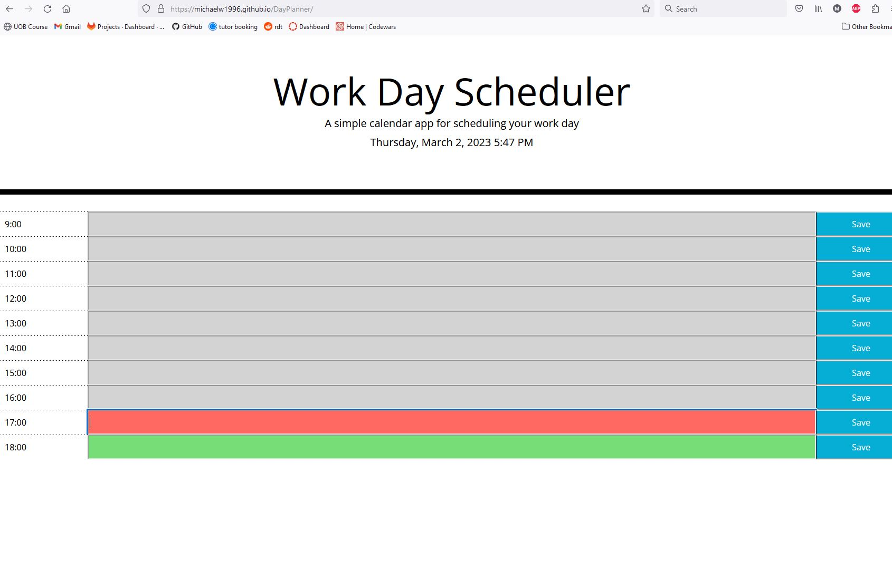

# Weekday Planner

### I've implemented a planner from an incomplete code. 

#### Below i have detailed the process of making this possible.

 

Link to live site: https://michaelw1996.github.io/Week_planner/

 

## Implemented Weekday planer:

Creation of elements:

    I used JavaScript to create elements dynamically, by doing this i can change the hours in the planner by only changing variables "DayStart" & "DayEnd" to the desired times in 24hr format

    This was implemented using for loops that start at "i" = "DayStart" and ends when "i" equal or greater than "DayEnd", as the loop progresses i use the "i" variable to print the time as well as to label the item with an id in an #Hour-i format.

    The generated content for each hour is comprised of the hour on the left, an input text box in the center and a save button on the right

Time based changes:

    At the top of the page i have displayed the current time in my desired format using MomentJS 

    I have then used the current time obtained with MomentJS to style the input text boxes depending on if this timeslot is in the past, present or future, this was done with conditional logic using if statements that compares the "hour" variable used to describe the slots hour with the current hour from MomentJS called "cHour". Depending on which is greater or if they are equal the blocks will be given a class which will style the text box accordingly

Local storage:

    I used a function "saveNotes" to store the the time slot and value in the text box to the local storage, this function is triggered by the save button on each time slot

    Each time the page is loaded a "for loop" is run that checks through the local storage and displays values that have been saved in local storage to the appropriate text box, this has been done in a "for loop" to avoid repetition and to allow for this service to scale in the same manner depending on the "DayStart" and "DayEnd" variables

Screenshot of deployed site:

## Code notes

HTML:

    No Changes from starter code made

CSS:

   Minor changes made to CSS, around ul element and .input class, this is to make the content fill the width of the page 

JS:

    Code functionality explained with a number of notes and in the above section 

Coded by Michael Walters